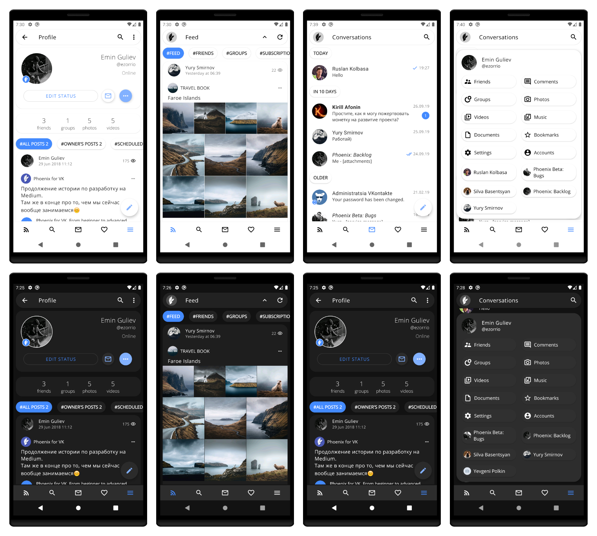

# Phoenix for VK
First open-sourced VK client for Android inspired by Material Design.

<b>Screenshots:</b>


<b>Available at Google Play</b><br>
  <b>Full:</b> https://play.google.com/store/apps/details?id=biz.dealnote.phoenix <br>
  <b>Lite:</b> https://play.google.com/store/apps/details?id=biz.dealnote.messenger

<b>Build guide:</b>
Requirements:
  1) Android Studio 3.0 Beta 7 or higher
  2) Android SDK r26, Build-Tools v.26.0.2
  
<b>Setting up enviroment:</b>
In order to build this project you need to add missing file with several VK keys.

  1) Create "build-config-fields.properties" file in the root of project with the following data

```
full_vk_app_id=6209567
full_gcm_sender_id=""
full_vk_service_token="7915b3df7915b3df7915b3dfd9794b73c0779157915b3df20c283430d77571be482c8b3"
full_vk_client_secret="FVstRaiX9SNaEPh0yo5N"
full_youtube_dev_key=""
lite_vk_app_id=6209567
lite_gcm_sender_id=""
lite_vk_service_token="7915b3df7915b3df7915b3dfd9794b73c0779157915b3df20c283430d77571be482c8b3"
lite_vk_client_secret="FVstRaiX9SNaEPh0yo5N"
lite_youtube_dev_key=""
```

You can use one value for Lite and Full version if you wish.

  2) We also need to configure Google Services in order to get push-messages and crash reports. Following files you can find in your Google Play console.<br>
  <b>Create files:</b><br>
    - app/src/lite/google-services.json <br>
    - app/src/full/google-services.json

  All project variables are setup now.

  3) Build APK via Android Studio
